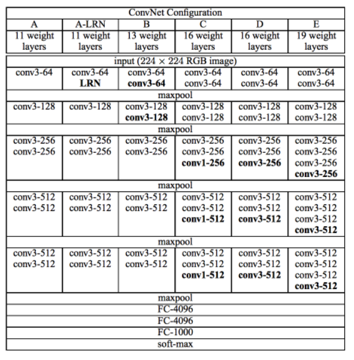

# COVID-19-detection-
This project aims to investigate the detection of COVID-19 on the CT scans using Keras, TensorFlow, and Deep Learning techniques. We compare four DCNN model that provides a good accuracy.

The CT scan images are provided in the folder COVID19\_Data. To be easier for computations, we resize all data to 128x128. We select 80% of samples (positive and negative) for training and the remaining 20% for testing per category.

In this project, I considered four DCNN models VGG16, VGG19, ResNet50, Xception (the model’s structures are shown in figures below). To find the best DCNN model, I considered different initialization method such as “glorot\_uniform”, “he\_uniform”, and “random\_normal”. Also, the activation function is ReLU. As the results below show, although VGG16 takes more time for processing, it is the best DCNN for this project as its accuracy is 0.996%, and it has a good balance between answers for either negative or positive answers. Based on the provided dataset, the worse model for detecting the Covid-19 can be the ResNet model. As you can see in the table below, the specificity is 0.566% which means the accuracy for detecting the negative cases is only 0.566%. 

The general model structure for VGGNet, ResNet, and Xception is shown in the figures below. Please see the appendix for the specific model used in this project.

**VGGNet model**

**ResNet Model**

**Xception model**

To show the effect of different initialization methods on the performance of the DCNN models, I chose the VGNN16 model, which has the best accuracy in comparison to the other models. To decrease the computation time, I changed epoch # to 3. The results in the table below show that the best initialization method for this project is He Uniform. I have taken the Adam as the optimization function in this experiment.

Training loss and accuracy of all the epochs are shown in the figures below. The results show that the VG16 model can converge faster than the other approaches.

|||
| - | - |
|||

To show the effect of different optimization functions (SGD, Adam, and RMSProp) on the performance of the DCNN models, I chose the VGNN16 model, which has the best accuracy compared to the other models. To decrease the computation time, I changed epoch # to 3. The results in the table below show that the best optimization function for this project is RMSProp. I have taken the Glorot Uniform as the initializer method in this experiment.

We can design a graphical user interface (GUI) that allows the user to select one CT scan image from a local file, run the testing process, and return the output as a message that says “Your COVID-19 Test Result” either ‘POSITIVE ‘or ‘NEGATIVE’. In this project I used a simple askopenfilename to open a file for testing.

**References:**

<https://cv-tricks.com/tensorflow-tutorial/keras/>

<https://cv-tricks.com/tensorflow-tutorial/training-convolutional-neural-network-for-image-classification/>

<https://cv-tricks.com/artificial-intelligence/deep-learning/deep-learning-frameworks/tensorflow/tensorflow-tutorial/>

<https://github.com/legolas123/cv-tricks.com>

<https://www.pyimagesearch.com/2020/03/16/detecting-covid-19-in-x-ray-images-with-keras-tensorflow-and-deep-learning/>

<https://neurohive.io/en/popular-networks/vgg16/>

<https://www.kaggle.com/eswarchandt/covid-19-detection-from-lung-x-rays/comments>

<https://www.kaggle.com/homayoonkhadivi/medical-diagnosis-with-cnn-transfer-learning>

<https://keras.io/api/applications/>

<https://www.pyimagesearch.com/2017/03/20/imagenet-vggnet-resnet-inception-xception-keras/>

<https://learnopencv.com/keras-tutorial-using-pre-trained-imagenet-models/>

<https://keras.io/api/layers/initializers/>

<https://www.tensorflow.org/api_docs/python/tf/keras/initializers/GlorotUniform>

**Appendix:**

**VGG16 model structure**

**VGG19 model structure**

Please see the attached file “log1.txt” for the ResNet50 and Xception model structure.
